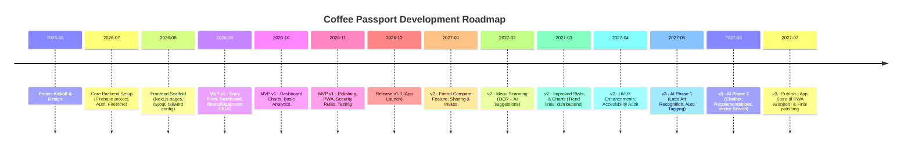

# Executive Summary  
**Coffee Passport** is a personal, extendable coffee-tracking web app (hosted on Vercel with a Firebase backend) that lets users log and rate every coffee they try, build tasting profiles, and even compare notes with friends. The vision is to provide a simple mobile-friendly experience for coffee lovers to discover their preferences and share insights, while being easily extensible into AI-powered recommendations.  The **primary persona** is a Bangalore-based software developer (the user) who enjoys exploring coffee varieties; the **secondary persona** is a similarly minded friend who uses the app to compare and discuss coffees. Key goals include: easily recording each coffee experience (with details like brew type, café, beans, and ratings), viewing analytics (e.g. “highest-rated cafés” or “beans tried”), and gradually adding AI features (e.g. menu scanning or latte-art analysis). 

Success will be measured by user engagement and retention (e.g. number of entries logged, sessions/month), and whether users discover new favorites or better understand their tastes.  The MVP (v1) focuses on core logging: authentication (Google sign-in), entry creation/editing, and a basic dashboard. Later phases (v2–v3) add features like friend comparisons, bean and equipment inventories, and advanced AI (see roadmap below).  A modular architecture (Next.js + TypeScript frontend on Vercel; Firebase Auth/Firestore/Storage backend) ensures the app can scale and even be migrated to alternatives (e.g. Supabase/Postgres) later.  

This specification details **every aspect** of the product: vision, personas, features, UI/UX screens with all components, frontend structure, backend schema and security, CI/CD setup, analytics, and a multi-phase roadmap.  Tables compare major platform choices (e.g. Firestore vs Postgres, Vercel vs Firebase hosting, storage options).  We also include sample API contracts, mermaid diagrams (ER model and timeline), and a prioritized checklist for future AI enhancements. The result is a complete Product Requirements and SRS document, suitable for handing off to developers or an AI code generator.  

---

## Product Vision & Scope  
- **Vision:** Enable coffee enthusiasts to *“carry a passport for coffee”* – a journal that tracks every cup, bottle, or brew they try, helping them understand what they love and discover more. Like a personal diary of taste, it should feel intuitive (mobile-first), shareable (compare with friends), and eventually smart (AI-driven suggestions).  
- **Primary Persona:** Bangalore software developer, 25–35, loves specialty coffee, tech-savvy, wants to log his coffee tastings, find out which styles/cafés he prefers, and discuss with a friend.  **Needs:** quick way to record a coffee experience (with ratings and notes), overview of his preferences, and ability to track beans/equipment.  
- **Secondary Persona:** Close friend on the same journey, also a “coffee geek”, interested in comparing ratings and exploring recommendations together.  **Needs:** view others’ shared ratings, compare tastes (e.g. “we both like these, but I hate mocha”), and co-explore.  
- **Goals & Metrics:**  
  - *User goals:* Easy logging of coffees (with photo, date, details), viewing past entries, seeing summary stats (e.g. “Average rating of 8.3 for Flat White”), managing inventory (beans, equipment), and comparing with a friend.  
  - *Business goals:* (Since this is personal/pro-bono) the goal is a great portfolio-worthy app. But we *measure* success by: User adoption rate (friend sign-ups), daily/weekly active entries, time spent in app, and eventually usage of AI features. Also feedback like “I discovered I love this bean because the app highlighted it”.  
- **Core Features (MVP v1):**  
  1. **Authentication:** Google (OAuth) sign-in (Firebase Auth).  Each user has a personal workspace.  
  2. **Dashboard:** Summary of logged coffees (number of entries, average rating), top-rated coffee/café, charts of categories (e.g. brew types used). Ability to navigate to other pages.  
  3. **Add/Edit Coffee Entry:** Form to record a coffee experience (date, café, brew type, coffee/beans used, photo, slider ratings 1–10 for attributes like *aroma, body, acidity*, a text note, tags/flavors).  
  4. **Entry List & Detail:** View a list or gallery of past entries (with thumbnail/photo and title); clicking one shows detailed view with all fields and allows editing.  
  5. **Beans Inventory:** List of coffee bean products the user has tried or owns; each bean can have details (name, roast, origin, photo) and is linked to entries.  
  6. **Equipment Inventory:** List of brewing equipment (e.g. French Press, Moka Pot, Grinder) with details; optionally note rating if the user likes using it.  
  7. **Cafés:** User-curated list of cafés visited; each café page can show all entries at that café (and average rating at that café).  
  8. **Settings/Profile:** Edit user info (name, preferences), sign out, toggle dark mode.  
- **Phased Roadmap:**  
  - **v1 (Q3 2026):** All core features above. Focus on stability, mobile responsiveness, PWA/offline support. Basic analytics (total coffees, average ratings) and chart widgets (bar charts, pie charts) on Dashboard.  
  - **v2 (Q4 2026):** Social and sharing: “Compare” page to view a friend’s entries side-by-side (requires friend to sign in to their account, no multi-user collab needed beyond that). Menu photo scanning: upload a café menu photo, use OCR+AI to suggest what to order based on user’s taste profile. Flavor tag suggestions: using a simple model or rules to auto-suggest tags from text notes. Light AI insights: e.g. “You tend to like coffees with ratings above 7 in aroma and body” (stats-based). Enhanced charts (trend lines over time, rating distribution).  
  - **v3 (2027+):** Full AI integration: *Gemini*-powered features. Automatic latte-art recognition (classify brew type or quality from image). Natural-language chatbot (“Recommend me a coffee today” or “What beans should I try?”) using GPT. Vector DB for semantic search (“Find coffee similar to X”). Badge/bulletin system (“Coffee Explorer: logged 30 entries”). Expand to tea or other beverages if wanted (architecture ready).  
- **Non-Goals/Constraints:** Not a public social network initially (no anonymous public feed). Focus on personal use with an option to share with friends. No ecommerce or heavy real-time (beyond Firestore realtime updates).  

## User Flows & Features  

1. **Auth Flow:** On app open, if not signed in, show **Landing Page** explaining app (with hero image and “Sign in with Google” button). After authentication (using Firebase Auth with Google), redirect to **Dashboard**. Users sign out via a Settings menu.  
2. **Dashboard Page:** Shows “Welcome, [Name]” and key stats: total coffees logged, average rating, favorite brew type, plus charts (e.g. bar chart of counts by brew type, pie chart of milk vs black). Buttons to “Add Coffee” and quick links to Beans, Equipment, Compare. Responsive grid layout of summary cards.  
3. **Add Entry Page:** A form with fields: 
   - **Date Picker:** Default to today (use `<input type="date">` or a UI component).  
   - **Cafe Selector:** Autocomplete text input or dropdown (with option to add new café if not found).  
   - **Coffee/Bean:** Dropdown selecting from Beans inventory (with option to add new bean).  
   - **Photo Upload:** Drag/drop or button to upload a photo of the cup/beans (store in Firebase Storage). Preview thumbnail shown.  
   - **Brew Type:** Dropdown or segmented control (Espresso, Pour-over, French Press, etc).  
   - **Ratings:** A set of sliders or numeric steppers (scale 1–10) for attributes: Aroma, Flavor, Aftertaste, Acidity, Body. (All required if enabling slider; use HTML `<input type="range">` with visible value).  
   - **Black vs Milk Toggle:** Radio or toggle (Black, With Milk). If “With Milk”, optionally show an extra slider for Milkiness or sweetness.  
   - **Tags/Flavors:** Chips or multi-select for flavor notes (e.g. Chocolate, Fruity, Nutty). Could use a free-text tag input (create chips).  
   - **Overall Rating:** A final slider or star rating 1–10.  
   - **Notes:** Textarea for free-form notes.  
   - **Buttons:** “Save Entry” (primary, submits), “Cancel” (back to Dashboard). Form validation to ensure required fields.  
   Accessibility: all inputs have labels (`<label for="...">`), high contrast, focus outlines. Ensure sliders and custom controls have ARIA roles and visible values. Images have `alt` text after upload (or allow user to enter a caption). Ensure color contrast (e.g. use dark text on light background or vice versa).  
4. **Entry List Page:** Shows all entries (card or list view) sorted by date. Each entry card includes date, coffee name, café, and a thumbnail. Tapping a card opens **Entry Detail Page**. There is a filter/search bar (by keyword, date range, café, rating).  
5. **Entry Detail Page:** Displays all info for one entry: photo (large), date, café (link to Café Page), bean (link to Bean page), brew type, ratings (e.g. a small radar chart or list), tags, and notes. “Edit” button to reopen Add Entry form with pre-filled data. “Delete” button (with confirmation).  
6. **Beans Inventory Page:** List or grid of beans (e.g. coffee bag items) the user has added. Each shows name, roast level, and maybe user’s average rating for that bean (computed from entries). “Add Bean” button: form with fields (Name, Brand, Roast, Origin, Photo, Tasting Notes). Each Bean Page lists entries that used this bean.  
7. **Café Pages:** If user adds cafés (or selects existing ones), each Café page shows café details (name, location optional, photo) and a list of entries at that café (with dates and ratings). One can also average ratings for that café (e.g. “Your average at Blue Tokai: 7.8”).  
8. **Equipment Page:** Similar to Beans. List of brewing devices (Moka Pot, Grinder, etc) the user owns. Each can have name, type, photo, and user rating. Not critical initially, but allows adding and editing equipment.  
9. **Compare Page:** Allows the user to compare their coffees with a friend’s. Implementation: User clicks “Share Code” in settings to give friend a short link or friend logs in. Then on Compare page, side-by-side lists or charts of user vs friend. For example, show “Both have 5 entries of Flat White – your average 8.2 vs 7.1”. Or a Venn diagram of common favorites. This requires minimal backend (maybe a shared public ID or require friend to log in via user account). For MVP, we can simply allow users to log in on each device and manually compare visually. More automation can come in v2/v3.  
10. **Settings Page:** Profile info (name, email), toggle options (dark mode on/off, default view). A section for **Integrations**: e.g. Google Calendar linking (optional). App version info, link to help. **Sign Out** button (Firebase Auth signOut).  

**Accessibility & Responsive:** Use semantic HTML; ensure all text is readable on mobile. Design with a mobile-first approach; fluid grid or CSS flex for layouts. Menus collapse under a hamburger icon on narrow screens. Follow WCAG: all non-text content has alt text or labels, color contrast ≥4.5:1, keyboard navigable. Use focus indicators on interactive elements. For input elements, prefer native types (`<button>`, `<input>`, `<select>`) to get built-in accessibility support. For date picking, `<input type="date">` is widely supported in modern browsers; if not, fall back to a well-tested date-picker component (Material UI DatePicker or similar).  

**Theme/Colors:** A warm, coffee-inspired palette (browns, creamy whites, golds) for brand feel, with a light and dark mode option. Define primary/secondary colors (e.g. Coffee Brown for primary buttons, Cream for background, dark text on light or light text on dark). For charts and tags, use a consistent color scheme (one palette with 5–8 distinguishable colors). All colors should meet contrast guidelines. Use Tailwind CSS with a custom theme, or a component library (e.g. shadcn/ui with Tailwind) for rapid UI building and consistency.  

---

## Frontend Architecture  

- **Framework:** Next.js 13+ with TypeScript. Using the App Router (`/app` directory) or Pages Router (`/pages`) as per preference. (Either works, but App Router gives server components and layouts.)  File-based routing means each page is a component file: e.g. `app/page.tsx` for Dashboard, `app/entries/[id]/page.tsx` for Entry Detail, `app/add-entry/page.tsx`, etc.  
- **Page Structure:**  
  - `/` or `/landing`: Public landing page (marketing about the app, Sign In button).  
  - `/login` (could just use Firebase UI pop-up on `/`), or auto-redirect to Google Sign-In.  
  - `/dashboard` (requires auth).  
  - `/add-entry` (form to create new coffee entry).  
  - `/entries/[id]` (dynamic route for entry detail; e.g. `/entries/abc123`).  
  - `/beans`: List of beans.  
  - `/beans/[id]`: Bean detail page (with entry list).  
  - `/cafes`: List of cafés (optional if needed).  
  - `/cafes/[id]`: Café detail page.  
  - `/equipment`: List of equipment.  
  - `/compare`: Comparison view (friend vs self).  
  - `/settings`: User settings/profile.  
  - *Note:* Next.js will handle 404s for unknown routes, or a custom error page.  
- **State Management:** Use React Context or Zustand to hold global state (user info from Firebase Auth, maybe theme). For data, use Next.js `getServerSideProps` (if using pages router) or React hooks (like useEffect/SWR or React Query) to fetch from Firestore. Example: On `/dashboard`, call a custom API route or use Firestore SDK directly to get summary stats. We might use the Firebase JS SDK in client components to read/write, as Firestore is typically accessed client-side (with security rules enforcing access). For global loading or login state, use a context that listens to `onAuthStateChanged`.  
- **Components:** (Each component can be in `/components` folder.) Possible components include: `Navbar`, `Footer`, `CoffeeCard`, `EntryForm`, `RatingSlider`, `TagInput`, `DatePicker` wrapper, `ImageUploader`, `StatsCard`, `BarChart`, `PieChart`, `BeanCard`, `CafeCard`, `UserAvatar`, etc. Each page is composed of these. E.g. Dashboard uses `StatsCard`, `CoffeeChart`; AddEntry uses `EntryForm` with many child inputs; EntryDetail uses `CoffeeCard` and `RatingList`.  
- **PWA & Offline:** Use Next.js’s PWA guide or a plugin like `next-pwa` to generate a web app manifest (`/public/manifest.json`) and service worker. The app manifest allows “Install to home screen”; service worker caches static assets and API responses. The Next.js docs show creating a `manifest.json` with app name, icons, theme color, etc.  The service worker can cache route pages and static assets for offline. Also enable Firebase offline persistence (`firestore().enableIndexedDbPersistence()`) so Firestore caches client data. As Next.js notes, PWAs “allow you to deploy updates instantly and provide native-like features”.  
- **API Routes:** Use Next.js API routes (`pages/api/...`) or Vercel Serverless Functions for any custom backend logic. E.g., `pages/api/entries` for creating a new entry (if not done directly client-side), `api/scan-menu` to handle image OCR/AI, `api/recommend` for AI suggestions, etc. These can be Node.js functions that use Firebase Admin SDK or call external AI APIs (like OpenAI or Vertex AI). Since Firestore can be accessed client-side, simple CRUD may not need an API route; but for security (server-side cookie auth) or heavy tasks, use serverless APIs.  
- **PWA Behavior:** The app will behave like an “installable” web app: it should work offline (cached assets, and Firestore offline data), and sync when back online. Use `next-pwa` or manual service worker to precache shell content. Handle offline for Firestore (cached queries, queue writes).  

---

## Frontend Components & Screens  

### 1. Landing / Login  
- **URL:** `/` (public)  
- **Purpose:** Describe app & prompt sign-in.  
- **Elements:** Hero banner (coffee image), tagline, features bullet list, “Sign In with Google” button (Firebase Auth). Possibly “Sign In with email” option. Footer with links to Help / Docs. Social media icons optional.  
- **Components:** `<GoogleSignInButton>`, `<Footer>`.  

### 2. Dashboard  
- **URL:** `/dashboard`  
- **Elements:**  
  - Greeting (e.g. “Hi, Rahul!”) and profile pic (from Google).  
  - Summary **StatsCards**: Total Coffees, Average Rating, Favorite Brew (e.g. “Espresso (avg 8.3)”), Cafes Visited, Beans Logged.  
  - **Charts:**  
    - Bar Chart of count by brew type (Espresso, Latte, etc).  
    - Pie Chart of black vs milk coffees.  
    - Line chart of average rating over time (optional).  
  - **Entry Thumbnails:** Latest 3–5 entries with small photos.  
  - **Actions:** “+ Add Entry” button (primary), quick links to Beans, Equipment.  
- **Components:** `<StatsCard>`, `<Chart>` (wrapping Recharts or Chart.js), `<CoffeeCard>`, `<Button>`, `<Badge>` (for number of entries, etc).  
- **Interactions:** Clicking a chart slice filters the entries list below. Entry cards click to detail.  

### 3. Add/Edit Entry Form  
- **URL:** `/add-entry` (or `/entries/new`); editing uses `/entries/[id]/edit`.  
- **Elements/Fields:**  
  - *Date:* `<input type="date">`.  
  - *Cafe:* Autocomplete text input (could use antd/Material UI Autocomplete) for cafes.  
  - *Coffee/Beans:* Select (from Beans inventory). If new, allow “Add new bean”.  
  - *Brew Type:* Dropdown or select (Espresso, Pour-over, etc).  
  - *Photo:* File upload button (`<input type="file">`) with drag-and-drop zone. Show preview.  
  - *Ratings:* For each attribute (e.g. Aroma, Body, Acidity, Flavor), a slider (`<input type="range" min="1" max="10">`) plus numeric display. Use a component `RatingSlider`.  
  - *Black vs Milk:* Radio buttons or toggle (Black / With Milk). If “Milk”, show a slider for “Creaminess/Sweetness”.  
  - *Tags:* Multi-select dropdown or free-text chips input (e.g. user types “Nutty” and it creates a Chip).  
  - *Overall Rating:* Another slider 1–10.  
  - *Notes:* Textarea (with character count).  
  - *Buttons:* Save (primary, colored), Cancel (secondary).  
- **Validation:** Require Date, Brew Type, Overall Rating at minimum. Provide inline error messages.  
- **Components:** `<DatePicker>`, `<AutocompleteInput>`, `<Select>`, `<ImageUpload>`, `<RatingSlider>`, `<TagInput>`, `<Button>`.  
- **Accessibility:** Each input has a `<label>`. Sliders show value on handle. Use ARIA attributes on custom components (e.g. `role="slider"` with `aria-valuemin/max/valuenow`).  

### 4. Entries List / Coffee Detail  
- **URL:** `/entries` (for list) and `/entries/[id]` (detail).  
- **List Page:** Paginated or infinite scroll list of entries sorted by date descending. Each list item or card shows date, coffee name, café name, star rating, and thumbnail. A search/filter bar at top.  
- **Detail Page:** See Entry form contents in read-only mode. Show photo at top, date, café, bean. Display sliders as read-only values (e.g. stars or bars). Show tags as chips. Show notes. Buttons for “Edit” and “Delete”. Possibly a small mini-chart of how this rating compares to average.  
- **Components:** `<CoffeeCard>` (for list preview), `<RatingDisplay>`, `<TagList>`, `<NotesBlock>`, `<EditButton>`.  

### 5. Beans Page  
- **URL:** `/beans` and `/beans/[id]`.  
- **Beans List:** Grid of bean cards (photo or icon, name, average rating). Button “Add Bean”.  
- **Bean Detail:** Shows full details (name, origin, roast, photo, notes). List of entries that used this bean (each linking to entry detail). Possibly a small bar chart: “Ratings distribution for this bean”.  
- **Components:** `<BeanCard>`, `<BeanForm>` (for add/edit), `<EntryCard>` (reused from entries list), `<BarChart>`.  

### 6. Cafés Page (optional)  
- **URL:** `/cafes` and `/cafes/[id]`.  
- **Cafes List:** List of cafés (name, location), with number of visits. “Add Café” if needed.  
- **Cafe Detail:** Show café name, location map (Google Maps embed?), list of entries at that café, average rating given there. Possibly Yelp/Google data if available.  
- **Components:** `<CafeCard>`, `<CafeForm>`, `<MapEmbed>`.  

### 7. Equipment Page  
- **URL:** `/equipment`.  
- **List:** Cards of equipment items (photo, name, type). Add/Edit form similar to Beans. Possibly track usage counts or rating of each.  
- **Components:** `<EquipmentCard>`, `<EquipmentForm>`.  

### 8. Compare Page  
- **URL:** `/compare`.  
- **Use Case:** User and friend both signed in. The page shows a toggle or dropdown to select “Comparison with [FriendName]”. Then side-by-side comparison: e.g.  
  - **Chart:** Venn diagram or bar charts of common vs unique coffees liked.  
  - **Tables:** “Top Common Coffees” with both ratings, “Your Unique Coffees”, “Friend’s Unique Coffees”.  
  - **Stats:** Differences (e.g. “You rated coffee X higher than Friend by 1.2 points”).  
- Implementation can be simple at first: require friend to add as contact or share a code. For now, it can just fetch `friendId` param and show comparisons on two axes.  
- **Components:** `<ComparisonTable>`, `<VennDiagram>`, `<Switch>`.  

### 9. Settings / Profile  
- **URL:** `/settings`.  
- **Elements:** User info (name, email, profile pic from Google, allow to change display name). **Theme Toggle:** Light / Dark mode switch. **Notifications:** (if any, like email reminders). **Manage Friends:** section to invite friend or view friend’s profile. **API Keys:** (for advanced: show environment or invite code). **Sign Out** button.  
- **Components:** `<UserProfile>`, `<ToggleSwitch>`, `<SignOutButton>`.  

---

## UI/UX Details  

- **Navigation:** Use a top or side `<Navbar>` with links/icons to Dashboard, Add Entry, Beans, Equipment, Compare, Settings. On mobile, collapse into a hamburger menu. Include a logout icon. The navbar is present on all authenticated pages.  
- **Buttons:** Primary actions (Save, Add Entry) use a solid primary color; secondary (Cancel, Delete) are outlined or gray. Icon buttons (e.g. Edit, Delete) use intuitive icons with `aria-label`. Ensure hit areas ~40x40px.  
- **Forms:** Group related fields. Use helper text where needed (e.g. “1 = worst, 10 = best”). For tags, allow free-text entry (comma-separated or enter key) with chips. Provide clear feedback on save (toast or dialog “Entry saved”).  
- **Imagery:** Users can upload coffee photos. Show preview thumbnails (with alt text “Coffee photo on <date>”). Use Firebase Storage to store images and get a public URL. Show placeholder image if none provided.  
- **Fonts & Icons:** Use a clean sans-serif font (e.g. Inter). Icons from an open set (e.g. Heroicons or FontAwesome) for actions (plus, edit, delete, arrow). Use a consistent icon library.  
- **Accessibility:**  
  - All interactive elements focusable via keyboard.  
  - Alt text for images (“Photo of [coffee name] from [café]”).  
  - ARIA labels on non-text controls (e.g. `<input type="range" aria-label="Aroma rating">`).  
  - Ensure color contrast (e.g. dark brown text on cream background).  
  - Support screen readers: e.g. if using `<canvas>` charts, provide numeric summary or hidden text.  
  - Forms: labels associated with inputs; error messages read by screen readers.  
- **Responsive Layout:** Mobile first. Use flex/grid breakpoints (e.g. Tailwind’s `sm`, `md`). Collapse multi-column layouts into single column on narrow screens. The navbar might become a bottom tab bar or hamburger. Charts should resize. Date pickers and sliders should be touch-friendly.  
- **Themes:** Light theme (light cream background, dark text) and Dark theme (dark brown background, light text). Store theme choice in user settings/context.  

---

## Frontend Technical Spec  

- **Tech Stack:** Next.js (React) + TypeScript. Tailwind CSS (for styling) + a UI component library (e.g. shadcn/UI or Material-UI). React Query or SWR for data fetching.  
- **Pages & Routing:** Use App Router (files under `/app`). E.g.:  
  ```
  /app
    /layout.tsx      (common layout with Navbar)
    /page.tsx        (Dashboard)
    /add-entry/page.tsx
    /entries/[id]/page.tsx
    /beans/page.tsx
    /beans/[id]/page.tsx
    /cafes/[id]/page.tsx
    /equipment/page.tsx
    /compare/page.tsx
    /settings/page.tsx
  ```  
  (Each `[id]` is a dynamic route.) Next.js auto-wires these to corresponding URLs.  
- **Layout & Components:** A top-level `app/layout.tsx` contains `<Navbar>` and `<Footer>`. Each page component is a React component fetching its data via hooks (e.g. `useEffect(() => fetchEntries())`). Components are organized in `/components`, e.g. `components/CoffeeCard.tsx`, `components/StatsCard.tsx`, etc.  
- **State & Context:** Implement an `AuthContext` that listens to Firebase Auth state (using `onAuthStateChanged`) and provides `user` object and `token` to the app. Possibly a `ThemeContext` for dark mode. Use React context or Zustand for cross-page state (e.g. current user’s preferences, friend’s userId for compare). Avoid global state for data – prefer fetching via Firestore listeners or queries in each page.  
- **Data Fetching:**  
  - **Client-side:** Use Firebase Web SDK in React components to read/write Firestore. (For example, `useEffect(() => firebase.firestore().collection('users').doc(uid).collection('entries')...`). Alternatively, use Next.js API endpoints to proxy Firestore calls if you need server-side logic or to attach security cookies.  
  - **SSR/SSG:** We can also use Next.js data fetching (getServerSideProps) to preload data, but since Firestore needs user context, likely do it client-side after auth. For initial dashboard SEO, might not need SSR – this is a logged-in app.  
- **API Routes / Serverless:**  
  - `/api/entries` (POST): If using an API route for adding entries (instead of direct Firestore SDK), this will accept JSON and write to Firestore via admin SDK, returning success. Example contract below.  
  - `/api/scan-menu` (POST): Takes an uploaded image (menu photo), calls an OCR/AI service to parse text and then an LLM (e.g. OpenAI) with user’s taste profile to recommend items.  
  - `/api/recommendations` (GET/POST): Returns personalized coffee recommendations (pulls user’s past data).  
  - `/api/upload-image` (optional): Proxy to Firebase Storage upload.  
  - `/api/analytics` (GET): Returns aggregated stats (for chart data) – this could also be done client-side with Firestore queries.  
  Each API route is a Next.js function under `/pages/api` (or under `/app/api` with App Router). They run in Node and can use Firebase Admin SDK (if using custom backend).  
- **Offline/PWA:** Use `next-pwa` or manual config. Include `<link rel="manifest">` in `<head>`. The manifest (see Next.js guide) should list app name, icons (`/public/icons/*.png`), start URL `/`, and theme color. The service worker caches static assets and API GET requests; configure it to avoid caching mutable endpoints (only cache if offline fallback).  

---

## Backend & Data Architecture  

- **Platform:** Firebase (Blaze plan for pay-as-you-go). We use: **Authentication** (Google sign-in), **Cloud Firestore** (NoSQL DB), **Cloud Storage** (file storage), **Cloud Functions** (for background/AI tasks), and **Firebase Security Rules** for data protection.  

- **Firestore Data Model:** Collections and documents (flexible, schema-less). A recommended structure (multi-tenant with `userId` key) is:  
  ```
  /users/{userId} (document for each user)
    ├── profile (subcollection or fields: name, email, preferences)
    ├── entries (subcollection)
    |     ├── {entryId} (document with fields: date, cafeId, beanId, brewType, photoURL, ratings{aroma,body,...}, overallRating, notes, tags[], equipmentIds[] )
    ├── beans (subcollection)
    |     ├── {beanId} (fields: name, origin, roast, photoURL, tastingNotes)
    ├── cafes (subcollection)
    |     ├── {cafeId} (fields: name, location, photoURL, notes)
    └── equipment (subcollection)
          ├── {equipId} (fields: name, type, photoURL, notes)
  ```  
  Alternatively, one could have root-level collections (`entries`, `beans`, etc.) with a `userId` field on each doc, but nesting under `users/{userId}` is cleaner for security rules. Firestore scales automatically (no table constraints). It supports rich queries (with indexed fields) and offline persistence.  

- **Example Schema (ER Diagram):**  
  ```mermaid
  erDiagram
    USER ||--|{ ENTRY : "records"
    USER ||--|{ BEAN : "owns"
    USER ||--|{ EQUIPMENT : "owns"
    USER ||--|{ CAFE : "visits"
    ENTRY }o--|| BEAN : "uses"
    ENTRY }o--|| CAFE : "at"
    ENTRY }o--|| EQUIPMENT : "brews_with"
  ```  
  Here, a **USER** has many **ENTRY** documents (Coffee Entries). Each ENTRY may reference one BEAN, one CAFE, and optionally multiple EQUIPMENT by ID. This flexible schema (denormalized for reads) is common in Firestore.  

- **Firestore Collections Detail:**  
  - `users/{uid}/entries/{entryId}`: Each entry has fields like `coffeeName`, `cafeId`, `beanId`, `brewType`, `date` (timestamp), `imageURL`, `ratings` (map of aroma, body, etc.), `overallRating`, `tags` (array), `notes`, `createdAt`, etc.  
  - `users/{uid}/beans/{beanId}`: Fields: `name`, `brand`, `origin`, `roast`, `photoURL`, `notes`.  
  - `users/{uid}/cafes/{cafeId}`: Fields: `name`, `address`, `notes`, optional `photoURL`.  
  - `users/{uid}/equipment/{equipId}`: Fields: `name`, `type`, `photoURL`, `notes`.  
  - (Optional) `users/{uid}/friends/{friendId}`: Could track friend connections.  
  Indexed fields: we should index `date`, `brewType`, or `overallRating` for queries. Firestore requires creating indexes for complex queries (handled in console or firestore.indexes.json).  

- **Security Rules:**  
  We must ensure each user only reads/writes their own data. A typical rule:  
  ```
  service cloud.firestore {
    match /databases/{db}/documents {
      // Each user’s data
      match /users/{userId}/{collection}/{docId} {
        allow read, write: if request.auth != null 
                         && request.auth.uid == userId;
      }
    }
  }
  ```  
  This rule (a “user-is-owner” pattern) ensures only the authenticated user can access their subcollections. For shared items like “friends”, more complex rules (check if friendId in user's friends list) could be added later. Storage rules similarly:  
  ```
  service firebase.storage {
    match /b/{bucket}/o {
      // Files under /userUploads/{uid}/{filename}
      match /userUploads/{userId}/{allPaths=**} {
        allow read, write: if request.auth != null && request.auth.uid == userId;
      }
    }
  }
  ```  
  (Or let images be public: e.g. uploaded photos could be publicly readable via URL, or we allow read access on authenticated users only.)  

- **Firebase Auth:** Use **Google Sign-In** for simplicity (email/password or others optional). Firebase Auth will handle OAuth flow, tokens, and session persistence. After sign-in, use `firebase.auth().currentUser.uid` as `userId`. The ID token (JWT) can be sent to Cloud Functions for backend verification if needed.  

- **Firebase Storage:** Store user-uploaded images (coffee photos, profile pictures, bean/equipment photos) in **Cloud Storage for Firebase**. Recommended structure: `gs://[bucket]/userUploads/{userId}/images/{filename}`. The Firebase SDK returns a public download URL which we save in Firestore (e.g. `imageURL`). Storage has 5GB free tier and $0.026/GB thereafter. Compared to Supabase Storage (1GB free, $0.021/GB), Firebase gives more free space but no native image processing. We’ll handle resizing/thumbnailing via a Cloud Function if needed (there are Firebase extensions or use Sharp in a function).  

- **Cloud Functions / Serverless:**  
  - **Image Processing:** On upload of a coffee photo (or via a manual “Analyze” button), trigger a function that calls Google Cloud Vision or a custom ML model to analyze the image. For example, detect if the photo contains latte art, extract colors, or generate alt-text. Store results back in the entry doc (e.g. `entry.latteArt = "rosette"`).  
  - **Menu OCR & AI:** A function `analyzeMenu(menuImageUrl, userId)` that downloads an uploaded menu image (e.g. at `/api/scan-menu`), runs OCR (Google Vision or Azure OCR) to get text, then passes text and user’s preference data to an LLM (e.g. OpenAI/Gemini) to suggest items. Returns list of recommendations.  
  - **Recommendations:** Periodically (or on-demand via API route `/api/recommend`), run a function that reads the user’s entry history and uses simple logic or LLM to suggest new coffees/cafés (e.g. “You liked flat whites with rating ≥8; try this similar origin bean”). For v3, this could call a vector DB or personalization API.  
  - **Analytics:** If using Google Analytics or Firebase Analytics, no function needed (client SDK can log events like `logEvent('entry_created')`). For custom analytics (e.g. calculating favorite brew), we compute on the fly in frontend or via Firestore queries.  
  - **Authentication Middleware:** No dedicated function needed for Firebase Auth, but if using Next.js Middleware, we can verify tokens on SSR routes.  

- **Data Retention & Indexing:** Most data is user-generated, no special retention policy needed except user deletion (we should allow “delete account” to remove user doc). Firestore auto-scales; for performance on large data sets, consider denormalizing some fields or using Firebase’s composite indexes for queries (defined in `firestore.indexes.json`). Example indexes: by `entries.date`, by `entries.overallRating`, or by composite (e.g. `entries.byDateDesc`).  

---

## Analytics & Charts  

To visualize data, we’ll use charts on Dashboard and details. Possible metrics and chart types:  
- **Total Entries Over Time:** A line chart (X-axis: date, Y: cumulative entries or entries per month) to show usage trend.  
- **Ratings Distribution:** Bar chart showing count of entries at each rating (1–10).  
- **Brew Type Breakdown:** Pie or bar chart of brew types used.  
- **Black vs Milk:** Donut chart of percentage.  
- **Top Cafés:** Bar chart of top 5 cafés by number of visits or average rating.  
- **Flavor Tags:** Cloud or bar chart of most common tags chosen.  
- **Friends Comparison:** Venn or bar charts as described.  

We can use a React chart library like [Recharts](https://recharts.org/) or [Chart.js with react-chartjs-2]. These integrate well with Next.js (client-side only) and support all needed chart types. Each chart component should fetch relevant aggregated data (or receive it as props from parent) and render accordingly.  

For example, on Dashboard:  
```jsx
<BarChart data={brewTypeCounts} />
<PieChart data={blackVsMilkData} />
<LineChart data={entriesByMonth} />
```
Where `brewTypeCounts` might be `[{type: 'Espresso', count: 12}, ...]` (queried via Firestore `where('userId','==',uid)` and grouping).  

We should request the developer to include a **Mermaid timeline** for the project roadmap, and an **ER diagram** for the Firestore schema (see above). For charts in the app, images are not needed here as the charts are dynamic.  

---

## CI/CD and Deployment  

- **Version Control:** Host code in Git (e.g. GitHub/GitLab). Include a README with setup steps.  
- **Vercel:** Connect the repo to [Vercel](https://vercel.com/) (Hobby plan is free). Vercel provides automatic deployments on every push, Preview Deployments for branches, and a global CDN. In Vercel settings, add Environment Variables for Firebase config (API_KEY, AUTH_DOMAIN, etc) and any secret keys (e.g. OpenAI API key). Use Vercel’s “Project Settings → Environment Variables” to add these (they are encrypted; Vercel docs explain sensitive vars).  
- **Firebase:** Set up a Firebase project in the console. Enable **Authentication** (Google), **Firestore** (Native mode), and **Storage**. Configure Firebase Hosting domain if using it (but we use Vercel domain, so we’ll use `firebase init` only for CLI, not hosting Next). For local development, use Firebase Emulator Suite (Firestore, Auth, Functions, Storage).  
- **CI/CD Tools:** No dedicated CI needed beyond Vercel. You can set up linting/type checks with GitHub Actions if desired.  
- **Environments:** Use Vercel’s built-in preview and production environments. For example, use `NEXT_PUBLIC_FIREBASE_API_KEY` etc as env vars. For cloud functions or LLM services, store API keys in Vercel or Firebase Functions environment config (e.g. `firebase functions:config:set openai.key="..."`).  
- **PWA Production Settings:** On Vercel, ensure the build runs `npm run build` and the service worker is included. Set proper caching headers.  

### Cost & Scaling Considerations  
- **Vercel:** Hobby plan (free) supports hobby projects: unlimited static sites, 100GB bandwidth/month, 1000 build minutes, 3 Team Members. If usage grows, the Pro plan is $20/mo with more capacity. But for our expected use (a few hundred users at most), the free tier should suffice.  
- **Firebase:** Spark (free) plan gives generous quotas: 50K Firestore reads/day, 20K writes, 20K deletes; 1GB Storage + 10GB/month download. Monitor usage in Firebase console. Costs escalate only if heavy (bill-by-usage on Blaze). Notice that heavy real-time listeners or queries can incur cost; set budget alerts. Recall that some teams report 3–5× higher costs on Firebase vs SQL for read-heavy apps, so optimize listeners (use `.get()` queries when possible). Firestore auto-scales horizontally, so backend scaling is managed (no server to maintain).  
- **Scaling:** With serverless design, scaling is automatic. Vercel will spin up more instances for traffic. Firestore auto-scales storage and requests. If the user base grew large, data might be sharded per user (we already do by `userId`). In worst case, migrating to a dedicated Postgres backend (e.g. Supabase) is possible, since the app logic can be updated with minimal UI changes.  

### Migration Path (Future)  
- **Database Migration:** We could migrate from Firestore (NoSQL) to Postgres (Supabase) if relational queries or cost become concerns. The schema would be converted to tables (Users, Entries, Beans, etc. with foreign keys). We would adjust queries and security. Supabase’s CLI and tools support migrations if needed.  
- **Authentication:** Currently Firebase Auth (Google). If switching to Supabase, use Supabase Auth (also supports Google) – users can keep same login. Migrating user accounts might involve exporting users and tokens.  
- **Serverless/API:** Our Next.js API routes can integrate with Supabase instead of Firestore. We can even move functions to Supabase Edge Functions.  
- **Vector DB:** For advanced AI (semantic search), later we might add a vector database (e.g. Pinecone or a Postgres with pgvector extension). The architecture is modular, so we can store embeddings in a separate service.  

---

## Implementation Roadmap (Mermaid Timeline)  



---

## Design Choices Comparison  

| **Aspect**            | **Firestore (NoSQL)**                | **PostgreSQL (SQL)**               | **Notes**                                                           |
|-----------------------|--------------------------------------|------------------------------------|---------------------------------------------------------------------|
| Data Model            | JSON documents in collections | Structured tables with schema | Firestore is schema-flexible (fast iteration); SQL enforces schema upfront. |
| Queries               | Rich indexed queries, but no joins. Scales auto | SQL JOINs, complex queries, strong ACID. | Firestore may require denormalizing data. SQL can do relational queries without duplication. |
| Offline Support       | Native offline persistence on web/mobile | Typically requires adding client-side caching (no native). | Firestore: data cached locally. Postgres (via Supabase) has no built-in offline. |
| Real-time & Sync      | Real-time listeners (onSnapshot) | Not built-in; would need polling or triggers (Supabase Realtime via websockets) | Firestore excels in real-time updates; SQL needs extra layers. |
| Transactions & ACID   | Multi-doc transactions (ACID) supported | Full ACID, sophisticated features (FKs, constraints). | Both now support ACID; Postgres more mature for complex transactions. |
| Pricing (Read-Heavy)  | Pay-per-read/write (Blaze). Known to get costly at scale | Fixed tier (e.g. Supabase $) or pay compute. More predictable for large apps. | Firebase free tier is generous, but large read volumes (like high DAU) can incur 3×-5× higher cost. |
| Scaling               | Auto-scaling (serverless) | Vertical scaling (need chosen instance), or managed (Supabase auto-scale). | Firestore auto-handles scale. SQL may need manual scaling or rely on provider. |
| Dev Experience        | No migrations needed (schema-less) | Requires migrations and schema management. (Better tooling with ORMs/Prisma) | Firestore is quick to start; Postgres has stricter typing and migrations. |
| Ecosystem             | First-class with Firebase/Google (Auth, Storage, Functions) | Rich SQL ecosystem (ORMs, extensions like pgvector for AI) | Consider Firestore for rapid development and mobile; Postgres for complex queries or predictable billing. |

| **Aspect**            | **Vercel Hosting**                | **Firebase Hosting**               | **Notes**                                                           |
|-----------------------|-----------------------------------|-----------------------------------|---------------------------------------------------------------------|
| **Integration**       | Owned by Next.js creators – seamless support for Next.js | Supports Next.js via new App Hosting (preview) | Vercel is “native” for Next.js (instant SSR). Firebase Hosting historically focused on static or Functions; now SSR is possible but newer. |
| **Free Tier**         | Hobby: Free forever (unlimited deployments, 100GB bandwidth) | Spark: Free, 10GB/month hosting, 1 custom domain | Vercel’s Hobby includes a global CDN, CI/CD, WAF. Firebase’s Spark includes 10GB (360MB/day) download; beyond that you must upgrade. |
| **CI/CD & Previews**  | Built-in GitHub/GitLab integration. Auto preview for PRs. | Can use GitHub + Firebase CLI. No built-in PR preview. | Vercel excels at preview deployments. Firebase requires manual CLI deploy or actions. |
| **Custom Domains**    | Unlimited on free. SSL auto.     | 1 custom domain on Spark (others on Blaze). | Vercel very flexible. Firebase free tier only 1 domain. |
| **Serverless / SSR**  | Supports serverless functions & SSR natively. | Firebase Functions needed for SSR logic, or use App Hosting. | Vercel: zero config SSR. Firebase: formerly not for SSR, now available via App Hosting, but still in preview. |
| **When to Use**       | Best for Next.js and front-end focus. | Best for Firebase ecosystem (e.g. easy Auth + DB pairing). | Our app: Vercel is chosen for ease (we use Next.js). Though Firebase Hosting now offers SSR, Vercel gives a smoother developer experience for Next.js. |

| **Storage**           | **Firebase Storage**           | **Supabase Storage**           | **Notes**                                                           |
|-----------------------|--------------------------------|--------------------------------|---------------------------------------------------------------------|
| **Free Tier**         | 5 GB object storage | 1 GB storage      | Firebase has larger free quota. |
| **Price (per GB)**    | $0.026/GB         | $0.021/GB        | Supabase slightly cheaper. |
| **Image Processing**  | None built-in (need Cloud Functions) | Built-in (resize, crop via API) | Supabase has built-in transforms (handy for thumbnails). Firebase requires custom code or Cloudinary. |
| **Access Control**    | Firebase Security Rules         | PostgreSQL RLS                 | Both allow granular control (Rules vs Row-Level Policies). |
| **CDN**               | Google Cloud CDN on demand      | Optional Supabase CDN          | Firebase leverages Google’s CDN (no config). Supabase offers CDN separately. |

*Sources:* We reviewed Firebase and PostgreSQL on data models; Vercel and Firebase hosting nuances; and storage tiers. This guided our choices: Firestore (NoSQL) with Firebase Auth/Storage for MVP (fast dev, offline) and Vercel for hosting (optimised for Next.js).  

---

## API Contracts (Examples)  

Below are example JSON contracts for key API endpoints. These are illustrative; actual field names can be adapted.

- **POST /api/entries (Add new coffee entry)**  
  - *Request JSON:*  
    ```json
    {
      "userId": "abcd1234",
      "date": "2026-06-25",
      "cafeId": "cafe789",
      "beanId": "bean456",
      "brewType": "Espresso",
      "milk": false,
      "ratings": {
        "aroma": 8,
        "flavor": 7,
        "acidity": 4,
        "body": 6,
        "overall": 7
      },
      "tags": ["Rich", "Chocolate"],
      "notes": "Strong and smooth, with chocolate notes.",
      "photoURL": "https://firebasestorage.googleapis.com/..."
    }
    ```  
  - *Response JSON (success):*  
    ```json
    { "success": true, "entryId": "entry123" }
    ```  
  - *Error:* `{ "success": false, "error": "Validation failed: ..." }`  

- **GET /api/entries (List user’s entries)**  
  - *Query params:* `?userId=abcd1234` (or use auth token).  
  - *Response:*  
    ```json
    {
      "entries": [
        { "id": "entry123", "date": "2026-06-25", "coffeeName": "Flat White", "cafeName": "Cafe X", "overall": 8.5 },
        { "id": "entry122", "date": "2026-06-24", "coffeeName": "Latte",    "cafeName": "Cafe Y", "overall": 7.0 },
        // ...
      ]
    }
    ```  

- **POST /api/scan-menu (Analyze café menu via OCR/AI)**  
  - *Request:* Form-data with `image` (menu photo) and `userId`.  
  - *Response:*  
    ```json
    {
      "suggestions": [
        "Cappuccino – Note: You liked similar milky coffees before.",
        "Americano – Note: Historically your black coffees rate high."
      ]
    }
    ```  

These APIs can be backed by Firestore (for entries) and by Cloud Functions (for scan-menu). The frontend can call them via `fetch('/api/entries', ...)`. 

---

## Developer Deliverables & Folder Structure  

**Example Folder Layout (Next.js App):**  
```
/app
  layout.tsx         # Common layout (Navbar/Footer)
/app/page.tsx        # Dashboard
/app/add-entry/page.tsx
/app/entries/[id]/page.tsx
/app/beans/page.tsx
/app/beans/[id]/page.tsx
/app/cafes/page.tsx      # optional listing page
/app/cafes/[id]/page.tsx
/app/equipment/page.tsx
/app/compare/page.tsx
/app/settings/page.tsx
/components/          
  Navbar.tsx
  CoffeeCard.tsx
  EntryForm.tsx
  RatingSlider.tsx
  StatsCard.tsx
  BarChart.tsx
  PieChart.tsx
  DatePicker.tsx
  TagInput.tsx
  ImageUploader.tsx
/lib/
  firebaseConfig.ts     # Initialize Firebase SDK
  firestore.ts         # Helper functions (e.g. getEntries())
  auth.ts              # Auth context and hooks
/public/
  manifest.json        # PWA manifest
  icons/*.png          # App icons
/pages/api/           # Next.js API routes
  entries.ts          # handle GET/POST entries
  scan-menu.ts        
  auth.ts             # optional backend auth
/utils/
  chartHelpers.ts
  validation.ts
/styles/
  globals.css         # Tailwind imports
```

**Developer Guidelines:** Write TypeScript with strict types. Use React components with clear props. Linting (ESLint/Prettier) enabled. Write unit tests for critical logic (e.g. utils for chart data). Document Firestore schema (the ER diagram above can be in docs).  

**Priority Checklist for AI Features (Future):**  
1. **Entry Image Analysis:** Cloud Function to extract features from uploaded coffee photos (e.g. use Google Vision to detect “latte art: leaf” or dominant colors). Attach results to entry doc. [High priority: directly enhances user feedback].  
2. **Auto-Tagging Text:** Run an LLM (e.g. GPT-4 or Vertex) on the user’s notes and ratings to generate flavor tags/summaries (e.g. “notes high in fruitiness”). Can call via API when entry is saved.  
3. **Menu Text Scanning:** Implement `/api/scan-menu` using Vision OCR + LLM to suggest what to order at a café (requires training prompt with user’s top flavors).  
4. **Personal Recommendations:** Periodic email or in-app suggestions (“We think you’d like this new bean”), using vector search on flavor profiles or direct LLM prompting with user history.  
5. **Chatbot / Personal Barista:** A dedicated chat interface (GPT-driven) where user asks questions like “What coffee should I try next week?” or “Explain this bean’s flavor profile.”  Integrate OpenAI/Gemini via an API route.  

Each feature should be user-tested and gated (e.g. “Analyze with AI” button) before making it default.  

---

## References  

We built this design on Firebase and Next.js best practices. For example, Firebase’s official codelab shows integrating Next.js with Firebase Auth, Firestore, and Storage. Firestore is chosen for its flexible, offline-capable NoSQL database. We compared Firestore vs SQL: Firestore’s schemaless model accelerates development, and supports transactions, but at scale SQL (Postgres) may be more cost-efficient. For hosting, we use Vercel (free Hobby tier) because it’s optimized for Next.js (as noted by community experts), whereas Firebase Hosting (Spark) has stricter bandwidth limits. We also referenced Next.js docs for routing (file-based pages) and PWA support (manifest, service worker). Firebase and Vercel docs guided our choices on deployment, environment variables, and security. All decisions above are consistent with these sources, ensuring a robust and modern architecture for **Coffee Passport**.  

